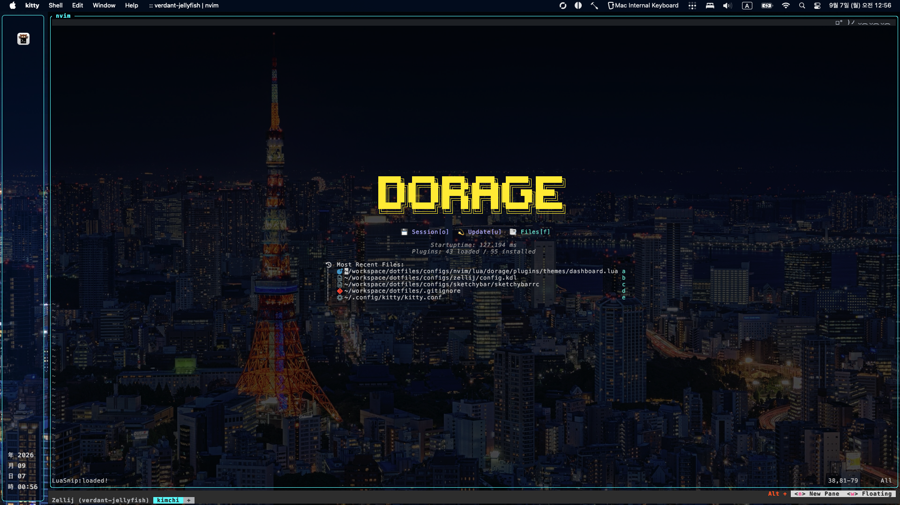

# Dev-Env

## Preview



## applications
 
| name | installation |
| --- | --- |
| alacritty | https://alacritty.org/config-alacritty.html |
| karabiner | https://karabiner-elements.pqrs.org |
| kitty |  |
| neovim |  |
| sketchybar | https://zellij.dev |
| zellij | https://zellij.dev |
| hammerspoon | https://www.hammerspoon.org |

## structure

```

.
+-- .hammerspoon
+-- config
|   +-- alacritty
|   +-- karabiner 
|   +-- kitty 
|   +-- nvim
|   +-- ranger
|   +-- sketchybar
|   +-- zellij
|   +-- zsh
+-- deps
|   +-- Brewfile
|   +-- Pacman
+-- keyboards
+-- services
|   +-- freshrss

```

## services

`docker compose` 로 어느 머신에서든 재현하는 self-hosted 서비스들.

| name | description |
| --- | --- |
| [freshrss](./services/freshrss) | RSS 리더. 볼륨을 1시간 주기로 Cloudflare R2 에 백업하고, 새 머신에서 복원해 그대로 이어 쓴다. |


