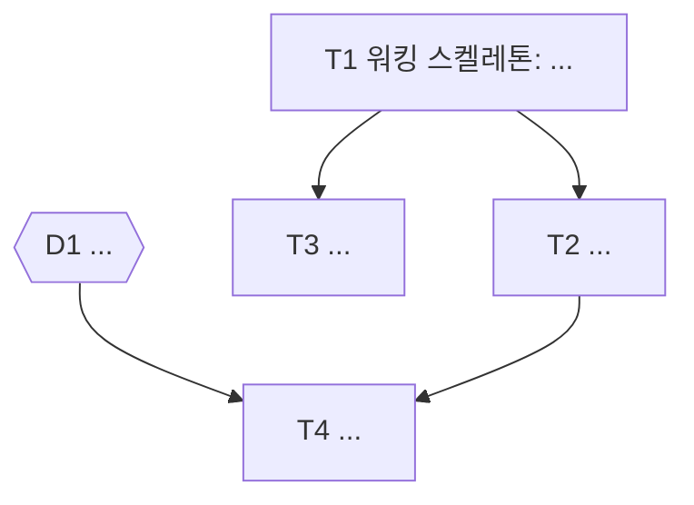

조사를 해서 작업 지시서가 되는 PR 을 만드는 커맨드예요. 입력 인자: `$ARGUMENTS`

먼저 `${CLAUDE_PLUGIN_ROOT}/references/common.md` 를 읽어요. 진행 방식에 대한 약속, 이슈 단독 입력 처리, 브랜치명 결정, 워크트리 생성, 빈 커밋과 푸시, 세션 ID 확인, Draft PR 생성, 보고 형식이 모두 거기 있어요. 이 파일은 워크트리를 만든 뒤 하는 조사와, plan 이 채우는 PR 본문을 정해요.

## plan 이 하는 일

plan 의 PR 본문은 그 자체로 작업 지시서예요. 기준은 하나예요: 이 PR 본문을 아무 컨텍스트 없는 새 세션에 넘겼을 때, 그 세션이 질문 없이 첫 커밋을 만들 수 있는가. 이 기준에 못 미치는 본문은 plan 의 산출물이 아니에요. 단, 사용자가 골라야 하는 갈림길은 예외예요. 그건 질문 없이 넘어갈 일이 아니라 "결정사항" 에 올려 사용자에게 묻는 일이에요.

`$ARGUMENTS` 가 비어 있으면 무엇을 조사하려는지 한 줄로 되묻고 멈춰요.

순서는 공통 절차의 워크트리 생성·빈 커밋·푸시까지 먼저 끝내고, 그 워크트리 안에서 조사한 뒤, 본문을 써서 PR 을 올려요. 조사를 먼저 하면 조사 도중 base 가 바뀌어 근거 라인이 틀어질 수 있어요.

## 요청 원문 기록

사용자가 `/wt:plan` 뒤에 적은 문장은 어떤 경우에도 PR 본문 "요청 원문" 절에 남겨요. 이 절이 빠진 본문은 올리지 않아요. 계획이 요청에서 어디까지 벗어났는지 나중에 대조할 수 있는 유일한 기준이 원문이기 때문이에요.

- 한 글자도 바꾸지 않아요. 오타, 줄임말, 말투, 줄바꿈까지 그대로 옮겨요. 요약하거나 다듬으면 사용자의 의도가 LLM 의 해석으로 바뀌어요.
- 인용 블록(`>`)으로 옮겨요. 여러 줄이면 줄마다 `>` 를 붙이고, 빈 줄은 `>` 만 남겨요. 인용 표시가 있어야 읽는 사람이 "이건 사용자 말"이라는 걸 구분해요.
- 이슈 단독 입력이었으면 `/wt:plan #123` 을 그대로 인용하고, 그 아래에 이슈 제목을 한 줄 덧붙여요.
- 계획 세션 중 사용자가 요구를 더하거나 바꿨으면, 그 발언도 같은 절에 시간 순서로 원문 그대로 덧붙여요. 결정사항에 대한 답은 여기가 아니라 결정사항 항목에 적어요.

## 조사

관련 코드를 실제로 읽어요. 읽지 않은 파일에 대해서는 한 줄도 쓰지 않아요. 확인 못 한 것은 "확인 필요" 로 표시해요. 추측이 섞인 계획은 후속 작업자가 계획을 검증하는 데 조사보다 더 큰 비용을 쓰게 만들어요.

조사에서 반드시 다루는 것:

- 영향 범위의 전수 목록. 바꿀 파일, 호출하는 쪽, 호출받는 쪽, 같은 패턴을 쓰는 다른 곳을 `path/to/file.ts:42` 형태로 전부 적어요. "등" 이나 "기타" 로 줄이지 않아요. 후속 작업자가 빠진 곳을 찾느라 다시 전수조사하지 않게 하려는 거예요.
- 현재 동작. 지금 코드가 무엇을 어떻게 하는지, 근거 위치와 함께.
- 기존 패턴. 같은 종류의 일을 이 코드베이스가 이미 어떻게 처리하는지. 새 코드는 그 패턴을 따라야 해요.
- 기본 불변식. 날짜 윈도우면 구체 날짜로 포함/미포함을, 수치 윈도우면 이상/이하/초과/미만을, 화폐·정산·결제면 소숫점 정밀도를 확인해요. 이 확인이 빠진 계획은 구현 단계에서 가장 흔하게 뒤집혀요.
- 외부 근거. 라이브러리 동작이나 API 스펙이 걸려 있으면 공식 문서를 읽고 URL 을 남겨요. 기억으로 답하지 않아요. 이름을 아는 것과 현재 동작을 아는 것은 달라요.

조사 규모가 크면 `Explore` 에이전트에 서로 독립적인 영역을 나눠 맡기고, 그 사이에 자기 몫을 계속 읽어요. 단일 파일이나 순차 추적이면 직접 읽는 편이 빨라요.

## 계획에서 지킬 원칙

- 완수조건을 먼저 정해요. "이게 되면 끝" 을 관찰 가능한 문장으로 써요. 완수조건이 스코프의 기준선이라, 범위 밖 요청이 들어오면 "별개 작업" 으로 분리할 근거가 돼요.
- 착수는 워킹 스켈레톤부터 잡아요. 빈 API 와 빈 화면을 연결해 한 경로가 끝까지 도는 것을 먼저 확인하고 살을 붙이는 순서로 TODO 를 배열해요. 이미 검증된 패턴의 반복이면 완성형으로 바로 가도 돼요.
- 되돌리기 어렵거나 1시간을 넘거나 팀 밖에 영향이 있으면 2~3개 안을 비교하고 추천안을 명시해요. 버린 안도 이유와 함께 남겨요. 후속 작업자가 같은 갈림길에서 같은 고민을 반복하지 않게 하려는 거예요.
- 안전망은 리스크에 비례해서 적어요. 되돌림 수단(feature flag, revert, 단계 배포), 데이터 보호(백업, 롤백 스크립트, 트랜잭션 단위), 점진 전환 중 무엇이 필요한지. 스키마 삭제나 데이터 마이그레이션처럼 되돌릴 수 없는 변경은 그 부분만 따로 분석해요.
- 조사 중 발견한 무관한 버그·컨벤션 결손은 고치지 않고 "범위 밖 발견" 에 적거나 `/side-issue` 로 넘겨요.

## 결정사항

갈림길은 두 종류로 나눠요.

- LLM 이 근거로 정할 수 있는 것: 코드베이스의 기존 패턴, 공식 문서, 완수조건으로 답이 나오는 갈림길이에요. 직접 정하고 "검토한 대안" 에 채택·버림과 이유를 남겨요.
- 사용자가 골라야 하는 것: 요구사항 해석, 스코프 경계, 비즈니스 우선순위, 되돌리기 어려운 변경, 비용·일정 트레이드오프처럼 코드가 답을 주지 않는 갈림길이에요. 추측으로 메우지 않고 "결정사항" 에 올려요.

결정사항 항목마다 다음을 적어요.

- ID 는 `D1`, `D2` 처럼 붙여요. TODO 와 DAG 가 이 ID 로 결정을 참조해요.
- 질문은 한 문장으로, 답이 A안/B안/C안 중 하나가 되게 써요.
- 선택지는 2~3개예요. 각 안에 무엇을 하는지, 장점, 단점, 예상 크기(30분, 반나절, 2일 같은 구체 단위), 되돌림 가능 여부를 붙여요.
- 추천안 하나를 이유와 함께 명시해요. 사용자가 추천만 보고 "그걸로" 라고 답할 수 있게 하려는 거예요.
- 막는 TODO 를 적어요. 이 결정이 나야 시작할 수 있는 TODO ID 목록이에요. 이게 있어야 결정 전에 먼저 돌릴 수 있는 일이 보여요.
- 상태는 `미결` 로 시작해요. 사용자가 답하면 `결정: B안` 으로 바꾸고, 그 답을 원문 그대로 인용해 붙여요.

결정사항이 없으면 절에 "없음" 한 줄만 둬요. 결정사항이 있으면 PR 을 올린 뒤 보고 끝에 결정사항 목록을 그대로 다시 보여주고 답을 받아요. 답을 받으면 결정사항 상태, 그 결정에 따라 바뀌는 TODO, 작업 DAG 를 함께 고쳐 `gh pr edit {번호} --body-file` 로 본문을 갱신해요.

## 작업 DAG

착수 가능한 시점이 되면 TODO 를 mermaid flowchart 로 그려요. 어떤 일을 동시에 돌릴 수 있는지, 지금 어디까지 왔는지를 PR 본문 하나로 보게 하려는 거예요.

- 착수 가능한 시점은 "선행 TODO 도 없고 미결 결정사항에 막히지도 않은 TODO 가 하나 이상 있을 때" 예요. 그 전이면 DAG 절에 `결정 대기: D1, D2` 한 줄만 두고, 결정이 나서 조건을 채우는 순간 그려요.
- 노드 하나가 TODO 하나예요. 노드 ID 는 TODO ID(`T1`, `T2`)와 같게 해요. 라벨은 `T1["T1 워킹 스켈레톤: 빈 API 연결"]` 처럼 큰따옴표로 감싸요. 괄호나 콜론이 섞여도 mermaid 가 깨지지 않아요.
- 간선은 "이게 끝나야 저걸 시작할 수 있다" 는 의존만 그려요. 순서가 편해서 이은 간선은 병렬 기회를 가려요. 간선으로 이어지지 않은 노드끼리는 병렬로 돌릴 수 있다는 뜻이에요.
- 미결 결정사항에 막힌 TODO 는 결정 노드를 거쳐요. `D1{{"D1 저장 방식"}} --> T4` 처럼 육각형 노드로 그리고, 결정이 나면 결정 노드를 지우고 확정된 안으로 TODO 라벨을 고쳐요.
- 완료 표시는 파란 배경이에요. `classDef done fill:#1f6feb,stroke:#1f6feb,color:#ffffff` 를 두고, 끝난 노드를 `class T1,T2 done` 에 넣어요. 끝난 노드가 하나도 없으면 `class` 줄은 두지 않아요. 빈 `class` 줄은 mermaid 문법 오류예요.
- DAG 바로 아래에 진행 규칙 인용 블록을 둬요(아래 형식 참고). 본문만 받은 후속 세션이 진행 표시를 이어서 하게 하려는 거예요.

## PR 본문 형식

````markdown
## 개요

{무엇을, 왜 하는지 한 문단}

## 요청 원문

> {사용자가 `/wt:plan` 뒤에 적은 문장을 한 글자도 바꾸지 않고 인용. 여러 줄이면 줄마다 `>`}

## 완수조건

- {관찰 가능한 조건. 예: "iOS 에서 FCM 알림 도착 시 default 사운드가 울린다"}
- {테스트로 확인할 수 있으면 그 테스트 이름}

## 결정사항

### D1. {한 문장 질문}

- 상태: 미결
- 추천: B안 — {이유}
- 막는 TODO: T3, T4
- A안: {무엇을 하는지}
    - 장점: ...
    - 단점: ...
    - 크기: {예: 반나절} / 되돌림: {가능·어려움과 이유}
- B안: ...
- C안: ...

## 조사 결과

### 현재 동작

{지금 코드가 하는 일. 근거는 `path/to/file.ts:42`}

### 영향 범위 (전수)

- `path/a.ts:10` — {이 파일이 왜 관련되는지}
- `path/b.ts:88` — ...

### 기존 패턴

{같은 종류의 일을 코드베이스가 처리하는 방식과 위치}

### 확인한 불변식

- {날짜/수치/소숫점 등 구체 예시와 결론}

### 확인 필요

- {조사로 확정 못 한 것과 어떻게 확인할지}

## 착수 방식

{어디부터 시작해 어떤 순서로 붙여 가는지. 워킹 스켈레톤이 되는 첫 단계를 명시}

### 안전망

- {되돌림 수단 / 데이터 보호 / 점진 전환 중 필요한 것}

### 검토한 대안

- 채택: {안 A} — {이유}
- 버림: {안 B} — {이유}

## 작업 DAG



> 진행 규칙: TODO 하나를 끝내 커밋을 푸시하면, 바로 이 본문에서 해당 TODO 체크박스를 체크하고 그 노드를 `class ... done` 줄에 넣어 `gh pr edit --body-file` 로 갱신한다. 완료 노드가 하나도 없으면 `class` 줄은 두지 않는다. 간선으로 이어지지 않은 노드는 병렬로 진행해도 된다.

## TODO

- [ ] T1 {단계 1 — 파일·함수 수준으로}
- [ ] T2 {단계 2} (선행: T1)
- [ ] T4 {단계 4} (선행: T2, 결정: D1)

## 테스트 방법

{검증 시나리오와 추가할 테스트}

## 범위 밖 발견

- {고치지 않은 무관한 문제. 없으면 "없음"}

## 세션

- 계획 세션 ID: `{uuid}`
- 근거 질문: `/qa {uuid}, {작업 지시}` 로 이 세션에 물을 수 있다

## 관련 이슈

- 해결할 이슈: #{번호}
````

본문을 쓰기 전에, 다음이 빠지지 않았는지 확인해요. 새 세션이 본문만 보고 일할 때 다시 만들기 가장 어려운 정보들이에요.

- 요청 원문이 인용 블록으로, 한 글자도 바뀌지 않고 들어갔는가.
- 사용자가 말한 제약과 요구는 원문 표현대로.
- 내린 결정과 버린 대안, 그 이유. 사용자가 골라야 할 갈림길은 결정사항에 선택지와 추천안까지 올라갔는가.
- TODO ID, DAG 노드 ID, 결정사항 ID 가 서로 맞는가.
- 조사로 확정된 사실과 아직 열린 것의 경계.
- 파일 경로, 라인, 함수명, 외부 URL 같은 재구성하기 어려운 세부.

이슈가 없으면 "관련 이슈" 절을 통째로 빼요.

## 보고

공통 절차의 보고 블록 뒤에, 미결 결정사항이 있으면 그 목록을 이어 붙여요. 사용자가 PR 을 열지 않고도 바로 답할 수 있게 하려는 거예요.

```
결정 대기:
- D1 {질문} — A안 {한 줄} / B안 {한 줄} (추천) / C안 {한 줄}
- D2 ...
답 예시: "D1 B, D2 A"
```

<example>
<user>/wt:plan #212 정산 리포트에서 환불 건이 매출에 이중 집계됨. 원인 찾고 수정 계획</user>
<response>
[gh issue view 212 / git fetch origin main 동시 실행 → 라벨 bug → fix/212-settlement-refund-double-count]
[EnterWorktree → 브랜치 rename → 빈 커밋 → 푸시]
[조사: settlement/report.ts, refund/handler.ts, 리포트 쿼리 3곳을 읽고, 환불 이벤트가 매출 테이블에 양수로 적재되는 지점을 특정. 정산 소숫점은 DECIMAL(12,2) 임을 스키마에서 확인]
[PR 본문 작성: 요청 원문 인용, 완수조건 2개, 결정사항 1개(D1 이미 마감된 정산 기간을 재발행할지: A안 재발행 / B안 다음 기간 조정분 / C안 손대지 않음, 추천 B안), 영향 범위 6개 파일, 불변식(소숫점·정산 기간 경계일 포함/미포함) 확인 결과, 대안 2개 비교, TODO 5개와 작업 DAG(T1 회귀 테스트 → T2 집계 쿼리 수정, T3 리포트 표시는 T1 뒤 병렬, T5 는 D1 에 막힘)]
[gh pr create --draft --body-file ...]

브랜치  : fix/212-settlement-refund-double-count
워크트리: /Users/me/repo/.claude/worktrees/212-settlement-refund-double-count
커밋    : d4e5f6a (empty)
PR      : https://github.com/org/repo/pull/213 (draft)
세션    : 7b1c2d3e-...
산출물  : 원인(환불 이벤트의 매출 양수 적재) 특정, 영향 6개 파일 전수, 완수조건 2개, TODO 5개와 작업 DAG. T1~T4 는 바로 착수 가능

결정 대기:
- D1 이미 마감된 정산 기간을 어떻게 할까 — A안 재발행 / B안 다음 기간에 조정분 반영 (추천) / C안 손대지 않음
답 예시: "D1 B"
</response>
<rationale>올바른 이유: 코드를 실제로 읽어 원인 지점을 특정했고, 영향 범위를 "등"으로 줄이지 않고 전수로 적었다. 요청 원문을 인용 블록으로 그대로 남겼다. 마감된 정산 처리처럼 코드가 답을 주지 않고 되돌리기 어려운 갈림길은 추측하지 않고 결정사항에 선택지와 추천안으로 올렸고, 그 결정에 막히지 않은 TODO 는 DAG 로 먼저 착수 가능하게 했다. 코드는 한 줄도 고치지 않았다.</rationale>
</example>
